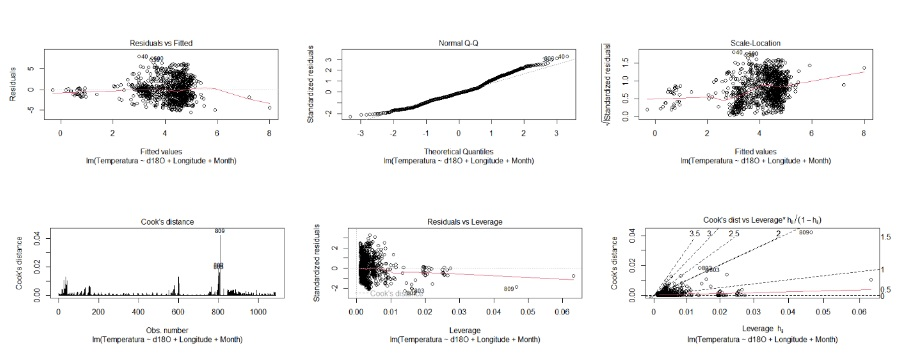

# izotopyO16-regresja
# Cel pracy:
Celem niniejszej pracy jest zbadanie liniowej zależności między temperaturą powierzchni Grenlandii a stężeniami stabilnych izotopów tlenu, oznaczanymi jako δ^18 O. 
Analiza ta ma na celu wsparcie badań nad oszacowaniem wieku lodu na Grenlandii, co jest istotne z punktu widzenia paleoklimatologii.

# Zestaw danych:
Źródła danych:
- Międzynarodowa Olimpiada Fizyczna 2013 (44. edycja, Dania),
- NASA (baza danych δ^18 O i temperatury dla Grenlandii).
  
# Zmienne uwzględnione w modelu:
- temperatura powierzchni (zmienna objaśniana),
- δ^ 18 O (zmienna objaśniająca),
- szerokość geograficzna,
- miesiąc pobrania próbki.

Po oczyszczeniu danych wykorzystano 568 obserwacji.

# Metodologia:
- Modelowanie liniowe: Zbadano liniową zależność temperatury od stężeń δ^ 18 O.
- Kryteria modelu: Analiza AIC, BIC oraz testy statystyczne (m.in. RESET, test Breuscha-Pagana, analiza współczynnika)
- Diagnostyka reszt: Badanie homoskedastyczności, normalności reszt oraz wpływu wartości odstających (wykresy diagnostyczne Cook's Distance, Q-Q plot).
# Wyniki:
- Model początkowy Uwzględniał wszystkie dostępne zmienne.
- Wartości odstające znacząco wpływały na wyniki, co zmniejszyło dopasowanie modelu.
- Istotność modelu została potwierdzona na poziomie 0.05 (p-value < 2⋅10−162⋅10 −16), jednak wpływ wartości odstających zniekształcał wyniki.
  \

\
a) wpływowe obserwacje są zaznaczone poza dystansem Cooka zaznaczonego na czerwono. Widzimy wyraźnie, że im większe wartości, tym większy mają wpływ na model. \
b) Q-Q sprawdzenie normalności i empirycznej dystrybuanty, która okazuje się być jeszcze bliższa dystrybuancie rozkładu normalnego. \
c) sprawdzenie homeoskatyczności:  gdy czerwona linia jest ustalona horyzontalnie możemy mówić o równej wariancji. Z rysunku wynika, że mają na model ogromny wpływ wartości większe. \
d) Cook's distance a więc badanie wpływu poszczególnych obserwacji i ich istotności. Jest kilka niezbyt wysokich dźwigni i ogólnie dźwignie nie są wysokie. \
e) Residua vs dźwignie: badanie wpływu poszczególnych obserwacji na model. Widzimy wyraźny wpływ wartości odstających.Czerwona linia jest niemal horyzontalna. \
f) zbiorczy wykres dystansu Cook'a a dźwigni. WIdzimy, że najlepszy model uzyskalibyśmy dla wartości bliskich 0. \
# Model poprawiony:

Usunięto wartości odstające, co poprawiło jakość dopasowania i zmniejszyło wpływ niepotrzebnych obserwacji.
Testy homoskedastyczności (Breuscha-Pagana) oraz RESET wykazały, że poprawiona wersja lepiej opisuje dane.

# Wnioski:
Istnieje liniowa zależność między temperaturą powierzchni Grenlandii a stężeniami δ^18 O.
Modele wymagają uwzględnienia wpływu wartości odstających i starannego doboru zmiennych.
Wyższe temperatury prowadzą do mniejszych wartości δ18O, co jest spójne z mechanizmem odkrywania starszych warstw lodu.
